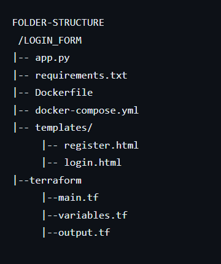

# Docker Implementation

## Prerequisites

### Windows:
1. Install Docker Desktop on your device and create an account.
2. Install the Docker extension in VS Code.

### Linux:
1. Install Docker using the terminal.
2. Create an account in Docker.

## Folder Structure

## Steps

1. Clone the git repository.
2. Open the file in the terminal or VS Code.
   1. Run `docker-compose build`.
   2. Run `docker-compose up`.
   3. Wait for the download to complete, and you will get the server link.
   4. Click on the server link, and the page will be visible.
3. Modify the `main.tf` file with your AWS region and AMI-ID as per your AWS configuration.
4. To apply Terraform, type in the terminal:
   1. `cd terraform`
   2. `terraform init`
   3. `terraform validate`
   4. `terraform plan`
   5. `terraform apply`
   
   This will successfully create the VPC and its subnet instances in your AWS account.

       

     
   
  

